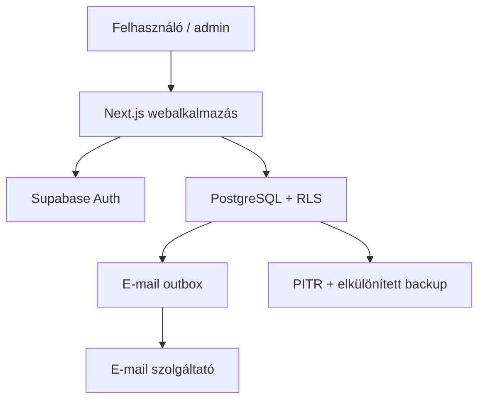
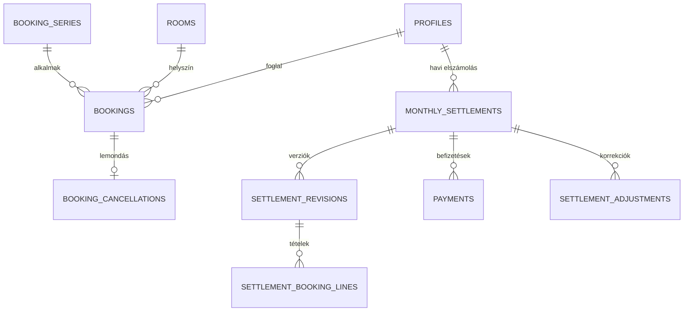

# A-Hely foglalási rendszer – technikai architektúra és adatmodell

Verzió: 1.0

Dátum: 2026-08-16

Státusz: fejlesztési alap

## 1. Döntési összefoglaló

Az alkalmazás moduláris monolitként készül. Egy Next.js/TypeScript webalkalmazás szolgálja ki a normál user és az admin felületet. Az adatok egy Supabase által menedzselt PostgreSQL-adatbázisban vannak; a bejelentkezést Supabase Auth biztosítja. A böngésző csak felhasználói jogosultsággal olvashat. Kritikus írások szűk, tranzakciós adatbázis-függvényeken vagy ellenőrzött szerveroldali szolgáltatásokon keresztül történnek.

Ez az architektúra elég egyszerű az A-Hely számára, nem épít általános SaaS-réteget, de biztosítja a dupla foglalás elleni adatbázis-védelmet, az auditálhatóságot, a későbbi riportokat és a reprodukálható elszámolást.

## 2. Végleges technológiai stack

| Terület | Döntés | Indok |
| --- | --- | --- |
| Webalkalmazás | Next.js App Router, React, TypeScript | Egy kódbázis, reszponzív UI és biztonságos szerveroldali végpontok. |
| Stílus | Tailwind CSS, hozzáférhető saját komponensek | Gyors, konzisztens mobil/tablet/asztali felület. |
| Adatbázis | Menedzselt PostgreSQL (Supabase) | Tranzakció, range/exclusion constraint, RLS, mentés és jó migrációs út. |
| Auth | Supabase Auth, e-mail+jelszó, meghívásos user-létrehozás | Nincs nyilvános regisztráció; jelszó-visszaállítás támogatott. |
| Adatelérés | `@supabase/ssr`; SQL-migrációk; kritikus írások PostgreSQL RPC-ben | A DB-kényszerek és tranzakciók egy helyen maradnak. |
| Validáció | Zod a szerverhatáron + DB constraint | Gyors felhasználói hiba és megkerülhetetlen adatvédelem. |
| Teszt | Vitest, pgTAP/Supabase DB teszt, Playwright | Üzleti logika, adatbázis-versenyhelyzet és teljes folyamat külön ellenőrizhető. |
| CI | GitHub Actions | Lint, típusellenőrzés, unit, DB-integráció és E2E kapu. |
| Hosting | Vercel, külön staging és production projekt | Egyszerű Next.js üzemeltetés és preview környezet. |
| E-mail | Cserélhető szolgáltatóadapter + tranzakciós outbox | E-mailhiba nem veszít el foglalást; újrapróbálható. |
| Megfigyelés | Strukturált alkalmazáslog + hibakövetés; DB technikai eseménynapló | Kritikus hibák azonosíthatók személyes adatok szükségtelen naplózása nélkül. |

Konkrét csomagverziót csak inicializáláskor, lockfile-ban rögzítünk. Production frissítés külön PR és teszt után történhet.

## 3. Környezetek és komponensek

- `local`: helyi Supabase/Docker, kizárólag szintetikus tesztadat.
- `staging`: külön Supabase- és Vercel-projekt, production-adat másolása nélkül.
- `production`: külön projekt, minimális jogosultságokkal és védett secretekkel.
- Migráció iránya: local → CI → staging → ellenőrzés → production.
- Production-migráció előtt automatikus backup/restore pont és visszaállítási terv szükséges.

## 4. Biztonsági modell

1. A kliensoldali UI nem jogosultsági határ.
2. Minden táblán RLS aktív; alapállapotban nincs hozzáférés.
3. Normál user csak a saját profilját, saját pénzügyi adatait és az engedélyezett naptáradatot látja.
4. Más foglalók nevét a lekérdezés maszkolja, ha a névláthatóság tiltott.
5. Admin státuszt az adatbázis `profiles.role` mezőjéből ellenőrizzük, nem önmagában egy potenciálisan elavult kliensclaimből.
6. A Supabase service-role kulcs kizárólag szerveren, néhány adminisztratív Auth-művelethez használható; böngészőbe soha nem kerülhet.
7. Kritikus írásoknál az adatbázisfüggvény újra ellenőrzi a szerepkört, a tulajdonost, a helyiségjogot, az időablakot és a speciális szabályokat.
8. Minden író végpont idempotenciakulcsot fogad; ismételt kérés nem duplikálhat foglalást, befizetést vagy korrekciót.

A helyiségkatalógus olvashatósága és a foglalási jogosultság külön réteg. Aktív user láthatja az alap helyiségkatalógust, de foglalást csak a `user_room_permissions` és az aktív csoportokból örökölt jogosultságok adatbázis-szintű ellenőrzése után hozhat létre. A közvetlen és csoportos `can_book` / `can_repeat` értékeket a JOIN-barát, `STABLE` `effective_room_permissions(user_id)` segédfüggvény egyesíti; a foglalási write-validátor és a naptár read-model ugyanebből az egyetlen forrásból dolgozik.

A naptár-read model egy kérésben legfeljebb 62 napos időintervallumot szolgál ki. Ez technikai erőforrás-korlát: lefedi a havi és kéthavi naptárnézetet, miközben megakadályozza a teljes foglalási történet egyetlen, korlátlan lekérdezéssel történő kiolvasását. Hosszabb riportok és exportok külön, célzott végpontot kapnak.

## 5. Foglalási tranzakció és ütközésvédelem

A `bookings` rekord `start_at` és `end_at` értéke UTC `timestamptz`; a megjelenítés és az ismétlődés számítása `Europe/Budapest` időzónában történik. A foglalási tartomány félig nyitott: `[kezdés, befejezés)`, ezért egy 10:00-kor végződő és egy 10:00-kor kezdődő foglalás nem ütközik.

Az adatbázis GiST exclusion constraintje tiltja, hogy ugyanahhoz a helyiséghez két aktív időtartomány átfedjen. Ez két párhuzamos kérésnél is atomi védelmet ad; az egyik tranzakció sikerül, a másik szabályos ütközési hibát kap.

Foglalás létrehozásának sorrendje egyetlen tranzakcióban:

1. hitelesített actor és cél-user meghatározása;
2. idempotenciakulcs ellenőrzése;
3. aktív user, helyiségjog és szerepkör ellenőrzése;
4. 30 perces rács, minimum idő, nyitvatartás és előrefoglalási limit ellenőrzése;
5. Tréningterem-szabályok ellenőrzése;
6. foglalás beszúrása, DB ütközéskényszerrel;
7. auditrekord és e-mail outbox esemény beszúrása;
8. commit.

Ismétlődésnél a rendszer előre kiszámítja az egyedi alkalmakat, és mindegyiket normál `bookings` rekordként tárolja. `abort_all` módban az egész sorozat egy tranzakció és bármely ütközés visszagörgeti; `create_available` módban az ütköző alkalmak dokumentáltan kimaradnak, a létrejött és kimaradt dátumok eredménye visszaadásra kerül.

A napi, heti, kétheti és havi dátumgenerálás az `Europe/Budapest` helyi faliórát tartja meg, ezért a DST-váltás nem tolja el a megszokott kezdési időt. A havi szabály az eredeti naptári napot követi; ha az adott hónap rövidebb, annak utolsó napját használja, majd a következő hosszabb hónapban visszatér az eredeti naphoz. Egy kérés legfeljebb 366 napot és 400 generált alkalmat fedhet le. Minden generált dátumhoz append-only eredményrekord készül: létrejött booking, explicit kivételdátum vagy dokumentáltan elérhetetlen alkalom.

## 6. Pénzügyi modell

Az aktuális havi dashboard számítható nézet. A pénzügyi visszakövethetőséghez viszont minden alkalmazott díj pillanatképe megőrzendő.

- A normál, sávos órák havi összegét userenként össze kell adni; a kiválasztott sáv díja az összes normál órára érvényes.
- Egyedi fix user-díj felülírja a sávos szabályt.
- A Tréningterem csoportos használata külön tétel, nem növeli a normál sávos óraszámot.
- A `settlement_revisions` minden újraszámítás összesített, megőrzött pillanatképe. A `settlement_booking_lines` ehhez a revisionhöz kötve tárolja a foglalást, percet, alkalmazott díjtípust, óradíjat, összeget és a szabály hivatkozását.
- Korrekció nem írja át nyomtalanul a múltat: külön `settlement_adjustments` rekord készül kötelező indokkal.
- A befizetés külön entitás; a fizetendő és a tényleges pénzbeérkezés nem keverhető.
- Nincs kötelező havi lezárás, de minden újraszámítás új, sorszámozott revisionrekordot hoz létre, így a korábbi állapot és az export forrása is reprodukálható.

## 7. Logikai adatmodell

### 7.1. Identitás és jogosultság

| Tábla | Szerep | Fontos mezők |
| --- | --- | --- |
| `profiles` | üzleti userprofil az `auth.users` mellett | név, e-mail, státusz, role, dashboard, névláthatóság, előrefoglalási override |
| `rooms` | helyiségtörzs | név, aktív, sorrend, `is_training_room` |
| `user_room_permissions` | közvetlen user-helyiségjog | user, room, `can_book`, `can_repeat` |
| `access_groups` | ismétlődő jogosultságcsomag | név, aktív |
| `access_group_members` | csoporttagság | group, user |
| `access_group_rooms` | csoport helyiségjoga | group, room, foglalás/ismétlés |

### 7.2. Beállítás, nyitvatartás és ár

| Tábla | Szerep |
| --- | --- |
| `app_settings` | típusos központi paraméter JSONB értékkel és validációval |
| `weekly_opening_hours` | hét napja szerinti normál nyitvatartás |
| `calendar_exceptions` | speciális nyitás vagy zárás egy dátumra |
| `pricing_tiers` | időben verziózott havi sávok |
| `user_price_overrides` | időben verziózott fix user óradíj |
| `special_room_rates` | Tréningterem csoportos, időben verziózott díja |

Árat nem írunk felül történetvesztéssel: új érvényességi sor készül. A régi elszámolás így újra előállítható.

### 7.3. Foglalás

| Tábla | Szerep |
| --- | --- |
| `booking_series` | reprodukálható ismétlődési kérés: helyiség, helyi kezdés, időtartam, időzóna, végfeltétel, konfliktuspolitika és idempotenciakulcs |
| `booking_series_occurrences` | minden generált alkalom append-only eredménye: létrejött, kivétel vagy elérhetetlen, opcionális booking-hivatkozással |
| `bookings` | minden konkrét alkalom; aktív vagy lemondott állapot |
| `booking_cancellations` | törlési pillanatkép, actor, időpont, ok, kezdésig hátralévő percek |

A `bookings` fizikailag nem törölhető az alkalmazásból. A lemondás állapotváltás és külön auditrekord. A történeti riportok a konkrét alkalmakból készülnek, nem a sorozatszabály utólagos újragenerálásából.

### 7.4. Elszámolás és export

| Tábla | Szerep |
| --- | --- |
| `monthly_settlements` | user+hónap üzleti elszámolási fejléce és státusza |
| `settlement_revisions` | minden újraszámítás megőrzött összesítő pillanatképe |
| `settlement_booking_lines` | revisionhöz kötött, foglalásonkénti árazási snapshot |
| `settlement_adjustments` | indokolt pozitív/negatív korrekció |
| `payments` | részfizetések, fizetési mód és célhely |
| `export_runs` | export időpontja, admin, hónap, felhasznált revision-manifeszt és fájl-ellenőrzőösszeg |

Minden pénzösszeg egész HUF (`bigint`), lebegőpontos pénzérték nincs. Az időtartam percben egész szám; az óraszám csak megjelenítési/számítási érték.

### 7.5. Üzemeltetés és bizonyíthatóság

| Tábla | Szerep |
| --- | --- |
| `audit_logs` | append-only üzleti audit: actor, művelet, rekord, előtte/utána, indok, correlation ID |
| `outbox_events` | tranzakciósan rögzített, újrapróbálható e-mail esemény |
| `system_error_logs` | releváns technikai hibák személyesadat-minimalizálással |
| `retention_candidates` | 2 éves megőrzés után jelölt rekordok és 30/15/5/1 napos értesítés |
| `retention_approvals` | admin jóváhagyás; automatikus végleges törlés nincs |

## 8. Indexek és kényszerek

- egyedi, kisbetűs e-mail;
- `bookings(room_id, start_at)` és `bookings(user_id, start_at)` index;
- GiST kizárás `room_id =` + `time_range &&`, csak aktív foglalásokra;
- `end_at > start_at`, legalább 60 perc, 30 perces többszörös és rács;
- egy userre/hónapra egy `monthly_settlements` rekord;
- egy foglalás egy settlement-revisionben egyszer szerepel;
- pozitív befizetés; korrekció lehet negatív, de oka kötelező;
- audit sor nem módosítható és nem törölhető;
- foreign key-k alapértelmezésben `RESTRICT`; üzleti/pénzügyi történetet cascade nem törölhet.

## 9. Backup, restore és adatmegőrzés

Production minimum:

- menedzselt adatbázis-backup és 7 napos PITR;
- napi titkosított logikai mentés az éles projekttől elkülönített tárhelyre;
- 35 napi és 24 havi generáció;
- negyedéves dokumentált restore-próba izolált környezetbe;
- minden restore-próba eredménye, időtartama és ellenőrzőösszege naplózva;
- RPO cél: legfeljebb 15 perc PITR-rel; RTO cél: 4 óra;
- backup nem kerülhet Git repository-ba;
- alkalmazásadat végleges törlése csak jelölés, figyelmeztetési sorozat és admin jóváhagyás után.

Fontos költségtényező: a Supabase PITR külön fizetős szolgáltatás. Az adatvesztés-tilalom miatt production előtt kötelező, és nem cserélhető le pusztán napi mentésre külön kockázati döntés nélkül.

## 10. CI/CD és release

Minden PR-en:

1. formázás/lint;
2. TypeScript típusellenőrzés;
3. unit tesztek;
4. friss adatbázison migráció + pgTAP;
5. integrációs teszt, benne két párhuzamos foglalási kísérlet;
6. Playwright kritikus smoke teszt;
7. dependency- és secret-scan;
8. kritikus területen független második review.

A `main` branch védett. Production deploy csak staging ellenőrzés, jóváhagyás és visszaállítási pont után történhet.

## 11. Implementációs sorrend

1. séma, kényszerek és seed;
2. Auth/profil/RLS;
3. helyiségjogosultság;
4. tranzakciós egyedi foglalás;
5. párhuzamos foglalási teszt;
6. ismétlődő sorozat;
7. módosítás és lemondás;
8. verziózott árak és havi számítás;
9. befizetés, korrekció, audit;
10. admin/user UI;
11. XLSX export;
12. e-mail outbox;
13. backup automatizálás és restore-próba;
14. teljes FS-elfogadási teszt és staging.

## 12. Nyitott üzleti döntések

Ezek nem blokkolják a séma és a foglalási motor első egységét, de a díjszámítás implementációja előtt jóváhagyás szükséges:

1. Lehet-e egy foglalás éjfélen átnyúló? A jelenlegi nyitvatartás alapján a javaslat: nem.
2. Az `Szja` exportmező pontos képlete és kerekítése külön pénzügyi szabályt igényel.
3. A számlakérés user-szintű alapérték, havi döntés vagy mindkettő legyen-e?
4. A production PITR és elkülönített backup elfogadott üzemeltetési költségkerete.

### 12.1. Jóváhagyott lemondási döntés

A normál user által legalább 24 órával a kezdés előtt szabályosan lemondott foglalás díja 0 Ft, és teljesen kimarad a havi elszámolásból. Ugyanez az elszámolási kizárás érvényes az admin által lemondott foglalásra. A `bookings` történeti sora, az eredeti állapotot rögzítő lemondási snapshot és az auditnyom minden esetben megmarad.

## 13. Elfogadási kritérium az első mérföldkőhöz

- friss helyi adatbázis egy paranccsal felépül;
- két átfedő aktív foglalást a DB nem enged ugyanabba a szobába;
- egymást érintő, de nem átfedő foglalás engedett;
- lemondott foglalás idősávja újra foglalható, miközben a történet megmarad;
- RLS bekapcsolt és alapból tilt;
- auditnapló alkalmazáson keresztül nem módosítható;
- a kritikus kényszerekhez automatikus DB-teszt tartozik.
